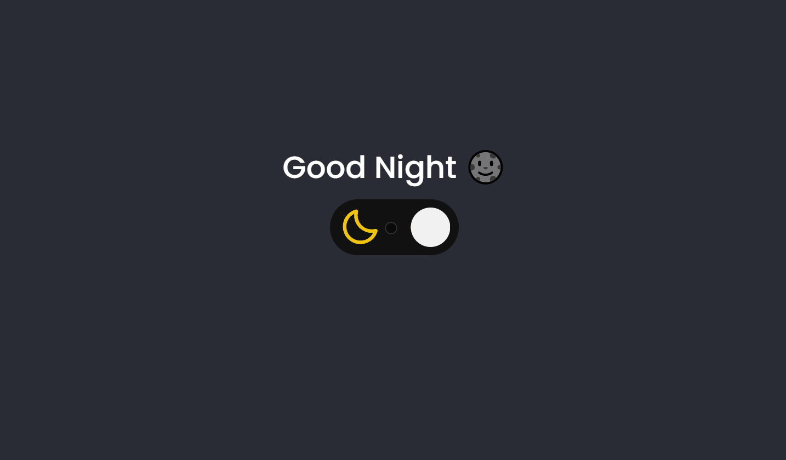

<h1 align="center">
  Theme Switcher
</h1>

Acesse em: https://theme-switcher-light-dark.netlify.app/

## 💻 Projeto

O Theme Switcher é um projeto desenvolvido por mim baseado em um desafio da escola RocketSeat. Basicamente é uma página que contém botões que alteram o tema do
background e trocam as frases. O tema é salvo no localstorage do usuário, fazendo com que ele não precise ajustar toda vez que acesse a página.

<h2>Desktop</h2>

  

## 🚀 Tecnologias

Esse projeto foi desenvolvido com as seguintes tecnologias:

- HTML
- CSS
- JavaScript

Bibliotecas

- [Google Fonts](https://fonts.google.com/)
